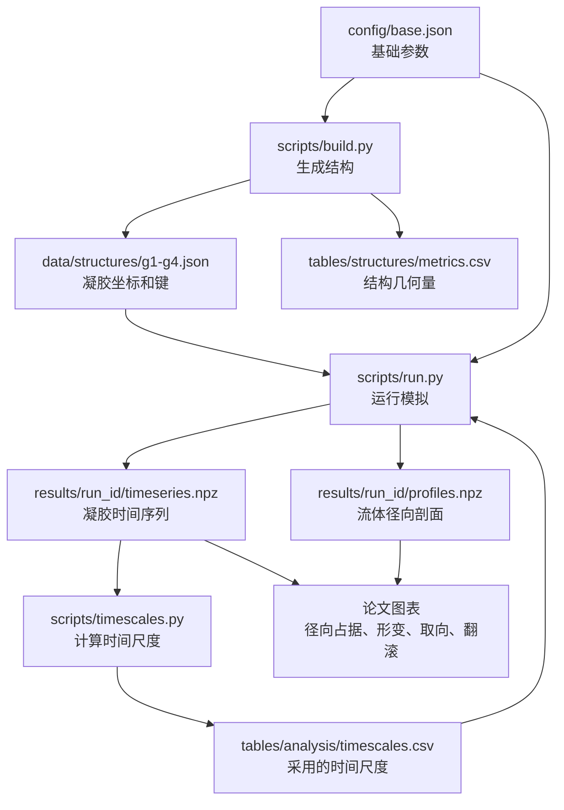

# 论文所需物理量与统计量的完整推导

_适用于当前 `mpcd` 项目：整体 `n×n×n` 三维网格凝胶、圆管 Poiseuille 流、MPCD-MD 耦合模拟。_

---

## 1. 这份文件解决什么问题

这份文件从最基础的几何、力学和统计定义出发，把论文中需要使用的每一个量按逻辑顺序推导出来。它的目标不是罗列符号，而是回答三个问题：第一，这个量从哪里来；第二，它在代码和数据表里叫什么；第三，它在论文图表中能说明什么。

当前项目的核心对象是放在圆管中的交联凝胶。凝胶采用一个整体的 `n×n×n` 三维网格结构，相邻网格单元共用同一个交联点，因此 `g1`、`g2`、`g3`、`g4` 分别代表 `n=1,2,3,4` 的整体网络。流体由 MPCD 溶剂表示，凝胶珠子通过 MD 势函数运动，并作为嵌入粒子参与 MPCD 碰撞，从而保留溶剂介导的动量交换。

下面把解释直接放在每个公式附近。每个量都在第一次出现时说明：这个符号代表什么、单位是什么、怎么从模拟数据算出来、数值变大或变小意味着什么。

---

## 2. 项目数据链条

论文里的每个物理量都应该能从一条清晰的数据链追溯回来。当前项目的数据链如下。



这条链条的含义是：结构量来自 `build.py`，轨迹量来自 `run_timescale.py` 和 `run_flow.py`，时间尺度来自 `timescales.py`。正式运行长度不再由单独任务表保存，而是在 `run_flow.py` 启动时读取 `timescales.csv` 后即时计算。论文中不能出现没有来源的量，也不能把诊断量误写成主结论量。

---

## 3. 坐标系与圆管几何

模拟使用三维直角坐标系 `(x,y,z)`。圆管轴向取为 `z` 方向，横截面是 `x-y` 平面。圆管半径记为 `R`，管长记为 `L`。当前配置为

```text
R = 36.0
L = 100.0
```

管内任意点到管轴的径向距离定义为

```math
r = \sqrt{x^2+y^2}.
```

这里的 `x` 和 `y` 是粒子在横截面上的坐标，单位是 MPCD 长度单位 `a`；`r` 也是长度，单位同样是 `a`。`r` 不是三维空间距离，而是横截面上的径向距离。它只关心粒子离管中心轴有多远，不关心粒子沿 `z` 方向走了多远。`r=0` 表示在管中心轴上，`r` 越接近 `R` 表示越靠近管壁。

圆管体积来自圆柱体体积公式：

```math
V = \pi R^2 L.
```

这里的 `V` 是圆管内部可放置溶剂的几何体积，单位是 `a^3`。`R` 和 `L` 都是长度，单位是 `a`。半径 `R` 变大时，体积按 `R^2` 增长；管长 `L` 变大时，体积按 `L` 线性增长。

当前配置下，

```math
V = \pi \times 36^2 \times 100.
```

如果 MPCD 溶剂数密度为 `rho`，则溶剂粒子数为

```math
N_s = \rho V.
```

这里的 `N_s` 是溶剂粒子数，是纯计数，没有单位；`rho` 是 MPCD 溶剂数密度，单位是 `a^{-3}`；`V` 的单位是 `a^3`，所以 `rho V` 的单位相互抵消，最后得到粒子个数。`rho` 越大，同样体积中的溶剂粒子越多，流体热涨落更充分，但计算量也更大。

当前配置中 `rho = 5.0`，所以溶剂粒子数不是几百个，而是

```math
N_s = 5.0 \times \pi \times 36^2 \times 100 \approx 2.04 \times 10^6.
```

因此项目里真正的溶剂粒子数约为两百万个。这个量由 `scripts/run.py` 中的 `solvent_count()` 按 `rho*pi*R^2*L` 计算。

---

## 4. 整体 `n×n×n` 网格凝胶结构

### 4.1 结构参数的含义

当前凝胶结构由两个整数控制。

| 符号 | 配置名 | 当前值 | 含义 |
| --- | --- | ---: | --- |
| `n` | `structure.n_values` | `1,2,3,4` | 每个方向上的网格单元数 |
| `m` | `structure.segments_per_edge` | `5` | 两个相邻交联点之间的键段数 |
| `b_0` | `bead.bond_equilibrium` | `0.97` | 初始几何键长 |

一个 `n×n×n` 网络在每个方向有 `n` 个网格单元，因此每个方向有 `n+1` 层交联点。交联点是全局共享的，不会因为相邻单元相接而重复生成。

相邻交联点之间不是一根直接的长键，而是一条由 `m` 个键段组成的链。因为两端已经是交联点，所以每条边中间插入的普通链珠数为

```math
m-1.
```

这里的 `m` 是每条网格边被分成多少个键段，是纯计数，没有单位；`m-1` 是这条边中间额外插入的普通链珠数，也是纯计数。当前 `m=5`，所以每条网格边包含 `5` 个键段，中间有 `4` 个普通链珠。`m` 越大，同一个网格边上链珠越多，链段描述越细，但珠子数和计算量也会增加。

单个网格单元的初始边长为

```math
a_\text{cell} = m b_0.
```

这里的 `a_cell` 是一个网格单元的初始边长，单位是 `a`；`b0` 是初始几何键长，单位也是 `a`；`m` 没有单位。这个公式只用于生成初始坐标，不表示模拟中每条键永远保持这个长度。

当前配置下，

```math
a_\text{cell} = 5 \times 0.97 = 4.85.
```

这个长度只是初始构型的几何尺度。正式模拟中，键的真实力学响应由 FENE-WCA 键势和 WCA 排斥共同决定。

### 4.2 交联点数量

因为每个方向有 `n+1` 个交联点，所以交联点总数为

```math
N_\text{xlink} = (n+1)^3.
```

这里的 `N_xlink` 是交联点总数，是纯计数，没有单位。`n+1` 来自共享网格节点：`n` 个单元需要 `n+1` 层节点。这个量写入 `tables/structures/metrics.csv`，用于检查结构生成是否正确。

例如 `g3` 对应 `n=3`，则

```math
N_\text{xlink} = (3+1)^3 = 64.
```

这和 `tables/structures/metrics.csv` 中 `g3` 的 `N_xlink=64` 一致。

### 4.3 网格边数量

网格边分三类：沿 `x` 方向、沿 `y` 方向、沿 `z` 方向。

先看 `x` 方向。沿 `x` 方向有 `n` 段边；对每一段边，`y` 和 `z` 方向各有 `n+1` 个位置。因此 `x` 方向边数为

```math
N_{\text{edge},x} = n(n+1)^2.
```

这里的 `N_edge,x` 是沿 `x` 方向的网格边数量，是纯计数。`n` 表示每条 `x` 方向线上有多少段边，`(n+1)^2` 表示这类线在 `y-z` 平面中有多少条。

三个方向完全对称，所以总边数为

```math
N_\text{edge} = 3n(n+1)^2.
```

这里的 `N_edge` 是三维网络中所有网格边的总数，没有单位。它决定需要生成多少条链，也直接决定普通链珠数和键数。

例如 `g4` 对应 `n=4`，则

```math
N_\text{edge} = 3 \times 4 \times 5^2 = 300.
```

### 4.4 普通链珠数量

每条网格边中间有 `m-1` 个普通链珠，所以普通链珠总数为

```math
N_\text{chain} = N_\text{edge}(m-1)
              = 3n(n+1)^2(m-1).
```

这里的 `N_chain` 是普通链珠总数，是纯计数。它不包括交联点，只统计每条网格边中间插入的链珠。`n` 增大时，网格边数量快速增加，因此 `N_chain` 也会快速增加。

例如 `g4` 中 `n=4`、`m=5`，

```math
N_\text{chain}
= 3 \times 4 \times 5^2 \times 4
= 1200.
```

### 4.5 总珠子数

凝胶总珠子数等于交联点数加普通链珠数：

```math
N = N_\text{xlink}+N_\text{chain}
  = (n+1)^3 + 3n(n+1)^2(m-1).
```

这里的 `N` 是一个凝胶中的总珠子数，没有单位。它等于交联点和普通链珠的总和。这个量越大，凝胶越大、内部自由度越多，单条模拟也越耗时。代码和表格中常写作 `N` 或 `N_bead`。

当前四个结构的理论值如下。

| 结构 | `n` | `N_xlink` | `N_chain` | `N` |
| --- | ---: | ---: | ---: | ---: |
| `g1` | 1 | 8 | 48 | 56 |
| `g2` | 2 | 27 | 216 | 243 |
| `g3` | 3 | 64 | 576 | 640 |
| `g4` | 4 | 125 | 1200 | 1325 |

这些值应与 `tables/structures/metrics.csv` 完全一致。

### 4.6 键数量

每条网格边有 `m` 个键段，所以总键数为

```math
N_\text{bond} = N_\text{edge}m
              = 3n(n+1)^2m.
```

这里的 `N_bond` 是 FENE 键的总数，是纯计数。每条网格边由 `m` 个键段组成，所以总键数等于网格边数乘以 `m`。它用于检查结构连接关系是否完整，也决定键力计算的数量。

例如 `g2` 中 `n=2`、`m=5`，

```math
N_\text{bond}
= 3 \times 2 \times 3^2 \times 5
= 270.
```

这正是 `metrics.csv` 中 `g2` 的 `N_bond=270`。

### 4.7 当前结构尺度

当前结构表中最重要的几何结果如下。

| 结构 | `N` | `R_g` | `R_g/R` | `R99/R` | `clearance_99/R` |
| --- | ---: | ---: | ---: | ---: | ---: |
| `g1` | 56 | 3.689 | 0.102 | 0.095 | 0.905 |
| `g2` | 243 | 6.275 | 0.174 | 0.191 | 0.809 |
| `g3` | 640 | 8.770 | 0.244 | 0.286 | 0.714 |
| `g4` | 1325 | 11.235 | 0.312 | 0.381 | 0.619 |

这里 `R_g/R` 是凝胶尺寸相对于管半径的比例，用来标记受限程度。它的意思是“凝胶自身典型尺寸占管半径的多少”。例如 `g4` 的 `R_g/R=0.312`，表示凝胶回转半径约为管半径的 `31.2%`。

`R_g` 和 `R` 都是长度，单位都是 `a`，所以 `R_g/R` 没有单位。这个比值越大，凝胶相对管道越大，壁面和空间限制越可能影响构型；这个比值越小，凝胶越接近在宽管中的弱受限状态。`R99/R` 的含义类似，但它看的是 99% 珠子的径向外延，而不是回转半径。

需要注意的是，`R_g/R` 是一个结构尺度标签，不等于机制证明。它告诉我们凝胶和管道相比有多大，但不能单独证明某个现象一定由尺寸导致。真正的物理解释还要结合径向分布、形变、取向、流体剖面和时间尺度。

---

## 5. 凝胶相互作用模型

### 5.1 WCA 排斥势

凝胶珠子之间的短程排斥使用 WCA 势。WCA 势来自 Lennard-Jones 势在势能最低点处截断并平移，常用于粗粒化聚合物模型中表示排除体积作用。它的作用是防止珠子彼此穿透，使网络具有有限体积。

Lennard-Jones 势为

```math
U_\text{LJ}(r)
= 4\epsilon\left[\left(\frac{\sigma}{r}\right)^{12}
- \left(\frac{\sigma}{r}\right)^6\right].
```

这里的 `U_LJ` 是势能，单位是能量单位 `kBT`；`epsilon` 是能量强度，单位也是 `kBT`；`sigma` 是珠子排斥长度尺度，单位是 `a`；公式中的 `r` 是两颗珠子之间的三维距离，单位是 `a`，和前面圆管径向距离的含义不同。`r` 很小时，`(\sigma/r)^12` 项急剧增大，表示强排斥。

WCA 截断位置为

```math
r_c = 2^{1/6}\sigma.
```

这里的 `r_c` 是 WCA 势的截断距离，单位是 `a`。当两颗珠子的距离大于等于 `r_c` 时，WCA 相互作用为零；小于 `r_c` 时只保留排斥作用。

在 `r<r_c` 时保留排斥部分，在 `r>=r_c` 时势能为零。当前项目使用

```text
sigma = 1.0
epsilon = 1.0
```

因此 WCA 排斥长度尺度约为 `1.122`。

### 5.2 FENE-WCA 键势

相邻珠子之间的键使用 FENE-WCA 模型。FENE 的全称是有限可伸长非线性弹性。它的关键特点是：键可以热涨落，但不能无限拉长。Kremer-Grest 聚合物模型中常使用 FENE 键配合排斥势描述珠簧链[^3]。

FENE 势的常见形式为

```math
U_\text{FENE}(r)
= -\frac{1}{2}k r_0^2
\ln\left[1-\left(\frac{r}{r_0}\right)^2\right].
```

其中 `U_FENE` 是键势能，单位是 `kBT`；`r` 是成键两珠之间的距离，单位是 `a`；`k` 是键刚度，单位是 `kBT/a^2`；`r0` 是最大允许伸长尺度，单位是 `a`。当 `r` 接近 `r0` 时，对数项趋于无穷大，表示这根键不能继续被拉长。当前配置为

```text
fene_k = 30.0
fene_r0 = 1.5
```

物理含义是：当键长接近 `1.5` 时，势能急剧增大，从而阻止键继续拉长。初始几何键长 `b0=0.97` 小于最大伸长 `1.5`，所以初始结构不会一开始就处在接近断裂的极限位置。

---

## 6. MPCD 流体量

### 6.1 MPCD 的基本思想

MPCD 是一种介观流体模拟方法，也称多粒子碰撞动力学或随机旋转动力学。它把溶剂表示成大量点粒子，交替执行自由流动步和局部碰撞步。自由流动步推进粒子位置，碰撞步在小网格单元中交换动量。这样可以在较低计算代价下保留热涨落和流体动力学相互作用[^1][^2]。

当前项目使用的基本参数为

| 符号 | 配置名 | 当前值 | 含义 |
| --- | --- | ---: | --- |
| `a` | `mpcd.cell_size` | 1.0 | MPCD 碰撞网格长度 |
| `rho` | `mpcd.number_density` | 5.0 | 每单位体积的平均溶剂粒子数 |
| `m_s` | `mpcd.mass` | 1.0 | 溶剂粒子质量 |
| `k_B T` | `mpcd.temperature` | 1.0 | 热能尺度 |
| `dt` | `mpcd.dt` | 0.005 | MD 积分步长 |
| `h` | `dt * collision_period` | 0.1 | MPCD 碰撞间隔对应的物理时间 |
| `alpha` | `collision_angle_deg` | 130 度 | 随机旋转角 |

### 6.2 碰撞时间和平均自由程

MPCD 碰撞不是每一个 MD 步都发生，而是每隔 `collision_period` 个 MD 步发生一次。碰撞时间间隔为

```math
h = dt \times N_\text{collision period}.
```

这里的 `h` 是两次 MPCD 碰撞之间的时间间隔，单位是模拟约化时间；`dt` 是 MD 积分步长，单位也是时间；`N_collision period` 是隔多少个 MD 步碰撞一次，是纯计数。这个量越大，溶剂粒子在两次碰撞之间自由飞行越久。

当前配置中

```math
h = 0.005 \times 20 = 0.1.
```

热速度尺度来自温度和质量：

```math
v_\text{th} = \sqrt{\frac{k_B T}{m_s}}.
```

这里的 `v_th` 是热速度尺度，单位是 `a/时间`；`kBT` 是热能，当前取 `1.0`；`m_s` 是溶剂粒子质量，当前取 `1.0`。它表示溶剂粒子由热运动带来的典型速度。

当前 `k_B T=1`、`m_s=1`，所以

```math
v_\text{th}=1.
```

平均自由程可估算为

```math
\lambda = v_\text{th}h.
```

这里的 `lambda` 是平均自由程估计，单位是 `a`。它表示溶剂粒子在两次碰撞之间大约能飞多远。`lambda/a` 没有单位，用来判断自由程相对于 MPCD 网格是否过大。

当前

```math
\lambda = 1 \times 0.1 = 0.1.
```

相对于 MPCD 网格长度 `a=1`，有

```math
\lambda/a = 0.1.
```

这个量用于判断 MPCD 流体是否处在常见的低平均自由程设定范围内。它不是论文主结果，但应该在方法部分报告。

### 6.3 归一化驱动力强度

代码中流动通过沿 `z` 方向施加体力实现：

```math
\mathbf{f} = (0,0,f_z).
```

这里的 `f` 是施加在流体粒子上的体力加速度向量，在当前约化单位中可理解为 `a/时间^2`；只有 `z` 分量非零，所以它驱动流体沿管轴方向流动。

当前配置使用

```math
f_z = f_0 \mathcal{F},
```

这里的 `f_z` 是实际施加的轴向驱动力强度，单位是 `a/时间^2`；`f0` 是配置中的换算系数；`\mathcal{F}` 是配置和运行任务中的无量纲流强。`\mathcal{F}` 越大，施加的体力越强，稳态流速和剪切率通常也越大。

其中

```text
f_0 = flow.force_per_strength = 0.0001
\mathcal{F} = 配置中的 flow_strength
```

这里的 `\mathcal{F}` 是论文中直接使用的流强控制量，中文写作时称为“归一化驱动力强度”。当前三档为 `\mathcal{F}=0,1,3`，对应体力 `f_z=0`、`1.0e-4`、`3.0e-4`。魏森贝格数不是输入量，而是后续用纯流体速度剖面和凝胶弛豫时间计算出来的派生量。

### 6.4 Poiseuille 速度剖面

对于不可压缩牛顿流体，在圆管中受恒定轴向体力驱动且满足无滑移边界时，稳态速度剖面为抛物线：

```math
u_z(r) = u_\text{max}\left(1-\frac{r^2}{R^2}\right).
```

这里 `u_z(r)` 是半径位置 `r` 处的平均轴向速度，单位是 `a/时间`；`u_max` 是管中心速度，单位也是 `a/时间`；`r/R` 没有单位。这个公式说明理想圆管流在中心最快，靠近壁面逐渐减小。壁面处 `r=R`，所以

```math
u_z(R)=0.
```

管中心处 `r=0`，所以

```math
u_z(0)=u_\text{max}.
```

速度剖面的径向导数给出局部剪切率大小：

```math
\dot{\gamma}(r)
= \left|\frac{du_z}{dr}\right|
= \frac{2u_\text{max}}{R^2}r.
```

这里的 `dot_gamma(r)` 是局部剪切率，单位是 `1/时间`。它表示速度沿径向变化有多快。中心处 `r=0` 时剪切率为零，越靠近壁面剪切率越大。凝胶如果长期待在较大 `r` 的位置，通常会经历更强剪切。

壁面剪切率为

```math
\dot{\gamma}_w
= \dot{\gamma}(R)
= \frac{2u_\text{max}}{R}.
```

这里的 `dot_gamma_w` 是壁面剪切率，单位是 `1/时间`。它常用来标记管流强弱，但本文的输入流强仍使用直接控制的 `\mathcal{F}`；剪切率由纯流体或含凝胶流体剖面后处理得到。

实际项目中，`profiles.npz` 存储的是模拟得到的 `mean_vz(r)`，它用于检查速度剖面是否接近 Poiseuille 形式。论文中如果要使用剪切率，优先从模拟剖面拟合得到 `u_max` 或局部斜率，而不是只引用解析公式。

---

## 7. 质心与径向占据量

### 7.1 凝胶质心

设凝胶有 `N` 个珠子，第 `i` 个珠子位置为

```math
\mathbf{r}_i=(x_i,y_i,z_i).
```

这里的 `r_i` 是第 `i` 个凝胶珠子的三维位置向量，单位是 `a`；`x_i`、`y_i`、`z_i` 分别是三个方向坐标，单位也是 `a`。下标 `i=1,...,N` 表示遍历凝胶中的所有珠子。

当前代码中所有凝胶珠子使用相同质量，因此质心就是坐标平均：

```math
\mathbf{R}_\text{cm}
= \frac{1}{N}\sum_{i=1}^{N}\mathbf{r}_i.
```

这里的 `R_cm` 是凝胶质心位置向量，单位是 `a`；`N` 是凝胶总珠子数，没有单位。因为所有珠子质量相同，所以直接取坐标平均即可。如果以后使用不同质量珠子，质心公式需要改成质量加权平均。

写成分量形式：

```math
X_\text{cm}=\frac{1}{N}\sum_i x_i,\quad
Y_\text{cm}=\frac{1}{N}\sum_i y_i,\quad
Z_\text{cm}=\frac{1}{N}\sum_i z_i.
```

`X_cm`、`Y_cm`、`Z_cm` 的单位都是 `a`。代码中这个量保存在 `timeseries.npz` 的 `com` 数组中。后续所有径向位置、均方位移和扩散系数都从这个质心时间序列得到。

### 7.2 质心径向位置

因为管轴是 `z` 方向，所以凝胶质心离管轴的距离为

```math
r_\text{cm}
= \sqrt{X_\text{cm}^2+Y_\text{cm}^2}.
```

这里的 `r_cm` 是凝胶质心到管轴的距离，单位是 `a`。它只使用 `X_cm` 和 `Y_cm`，不使用 `Z_cm`，因为我们关心的是凝胶在管横截面里靠中心还是靠壁。

归一化径向位置为

```math
\frac{r_\text{cm}}{R}.
```

这个量没有单位，范围通常在 `0` 到 `1` 之间。`r_cm/R=0` 表示质心在管中心轴附近，`r_cm/R` 越大表示质心越靠近管壁。论文中用它比较不同管半径或不同结构时更方便，因为它已经除去了管半径这个几何尺度。

论文中最直接的径向占据图可以画

```math
\left\langle \frac{r_\text{cm}}{R} \right\rangle
```

随结构 `g1-g4` 和流强 `\mathcal{F}` 的变化。尖括号表示先对单条轨迹的稳定时间窗口平均，再对不同 seed 平均。这个量越大，说明凝胶质心平均位置越偏离中心轴。

### 7.3 径向分布的两种定义

径向分布必须分清两种密度，否则容易把几何面积因子误认为物理富集。

第一种是按径向坐标统计的概率密度，记为

```math
p_\text{radial}(r).
```

这里的 `p_radial(r)` 是“按径向坐标统计”的概率密度，单位是 `a^{-1}`。它回答的是：质心落在 `r` 到 `r+dr` 这个径向区间内的概率是多少。

它满足

```math
\int_0^R p_\text{radial}(r)\,dr = 1.
```

这个归一化条件表示从管中心 `0` 到管壁 `R` 的所有径向概率加起来必须等于 `1`。如果直方图归一化后不满足这个条件，说明分箱或归一化写错了。

如果直接对 `r_cm` 做直方图并归一化，得到的就是这个量。

第二种是按横截面积统计的概率密度，记为

```math
p_\text{area}(r).
```

这里的 `p_area(r)` 是“按横截面积统计”的概率密度，单位是 `a^{-2}`。它回答的是：单位横截面积里找到质心的概率密度是多少。这个定义可以去掉圆环面积随半径增大的几何影响。

圆环面积元为

```math
dA = 2\pi r\,dr.
```

这里的 `dA` 是半径在 `r` 到 `r+dr` 之间的薄圆环面积，单位是 `a^2`。外圈圆环面积比内圈大，所以不能直接把外圈直方图高理解成真实富集。

因此两者关系为

```math
p_\text{radial}(r)\,dr
= p_\text{area}(r)\,2\pi r\,dr.
```

等式左边是质心落在径向小区间内的概率，右边是面积概率密度乘以圆环面积。两边都是概率，没有单位。

所以

```math
p_\text{radial}(r)
= 2\pi r\,p_\text{area}(r).
```

这说明即使质心在横截面上完全均匀，`p_radial(r)` 也会随 `r` 增大，因为靠外的圆环面积更大。因此论文主文必须明确使用哪一种分布。推荐主文使用 `p_area(r)` 或同时报告 `r_cm/R` 均值，避免只凭径向直方图判断近壁富集。

---

## 8. 回转张量与凝胶大小

### 8.1 相对质心坐标

为了描述凝胶自身形状，需要先把整体平移去掉。第 `i` 个珠子相对质心的位置为

```math
\mathbf{u}_i
= \mathbf{r}_i-\mathbf{R}_\text{cm}.
```

这里的 `u_i` 是第 `i` 个珠子相对质心的位置向量，单位是 `a`。它只描述珠子相对于凝胶中心的分布，不受凝胶整体在管中移动的影响。后面计算凝胶大小、形状和主轴都使用 `u_i`，而不是直接使用实验室坐标 `r_i`。

### 8.2 回转张量

回转张量定义为

```math
\mathbf{G}
= \frac{1}{N}\sum_{i=1}^{N}\mathbf{u}_i\mathbf{u}_i^\mathsf{T}.
```

这里的 `G` 是回转张量，单位是 `a^2`。`u_i u_i^T` 是一个 3×3 矩阵，表示第 `i` 个珠子相对质心的空间展开贡献；对所有珠子求平均后，就得到整个凝胶在三个方向上的尺寸和耦合信息。

写成矩阵形式：

```math
\mathbf{G}
=
\begin{pmatrix}
G_{xx} & G_{xy} & G_{xz}\\
G_{yx} & G_{yy} & G_{yz}\\
G_{zx} & G_{zy} & G_{zz}
\end{pmatrix}.
```

其中

```math
G_{xx}=\frac{1}{N}\sum_i u_{ix}^2,\quad
G_{yy}=\frac{1}{N}\sum_i u_{iy}^2,\quad
G_{zz}=\frac{1}{N}\sum_i u_{iz}^2.
```

`Gxx`、`Gyy`、`Gzz` 的单位都是 `a^2`。物理意义是：`Gxx` 表示凝胶在 `x` 方向的空间展开程度，`Gyy` 表示 `y` 方向展开程度，`Gzz` 表示管轴方向展开程度。`Gzz` 变大通常表示凝胶沿流向被拉长。

### 8.3 回转半径

回转半径平方定义为所有珠子到质心距离平方的平均：

```math
R_g^2
= \frac{1}{N}\sum_{i=1}^{N}|\mathbf{u}_i|^2.
```

这里的 `Rg^2` 是回转半径平方，单位是 `a^2`；`Rg` 本身是长度，单位是 `a`。它表示所有珠子相对于质心的平均平方距离，是描述凝胶整体大小最常用的量。

由于

```math
|\mathbf{u}_i|^2 = u_{ix}^2+u_{iy}^2+u_{iz}^2,
```

所以

```math
R_g^2
= G_{xx}+G_{yy}+G_{zz}
= \mathrm{Tr}(\mathbf{G}).
```

因此

```math
R_g = \sqrt{\mathrm{Tr}(\mathbf{G})}.
```

这个量是凝胶整体大小的主尺度。`Tr(G)` 表示回转张量的迹，也就是 `Gxx+Gyy+Gzz`。静态结构中的 `R_g` 写入 `metrics.csv`；运行中的瞬时 `Rg(t)` 写入 `timeseries.npz`。`Rg` 越大，说明凝胶珠子分布越分散；`Rg` 越小，说明凝胶越紧凑。

### 8.4 横向展开量

由于流动方向是 `z`，横向平面是 `x-y`，所以定义横向回转分量：

```math
G_\perp
= \frac{G_{xx}+G_{yy}}{2}.
```

这里的 `G_perp` 是横向回转分量，单位是 `a^2`。它把 `x` 和 `y` 两个横向方向平均起来，用来和流向分量 `Gzz` 比较。

`Gzz` 和 `Gperp` 的比较可以判断凝胶是在轴向被拉长，还是在横向保持较宽。

常用的无量纲形变比可以写成

```math
\frac{G_{zz}}{G_\perp}.
```

这是无量纲比值，因为分子和分母单位都是 `a^2`。若该比值大于 `1`，说明轴向展开大于横向平均展开；若接近 `1`，说明形状更接近各向同性。该量适合作为图 4 的核心形变指标。

---

## 9. 主轴、本征值和非球形度

### 9.1 回转张量本征值

回转张量是对称矩阵，因此可以对角化。设三个本征值为

```math
\lambda_1 \ge \lambda_2 \ge \lambda_3 \ge 0.
```

这里的 `lambda1`、`lambda2`、`lambda3` 是回转张量的三个本征值，单位都是 `a^2`。它们表示凝胶沿三个主轴方向的展开程度。其中 `lambda1` 对应最长主轴，`lambda3` 对应最短主轴。

回转半径也可以写成

```math
R_g^2 = \lambda_1+\lambda_2+\lambda_3.
```

这个公式说明回转半径平方可以由三个主轴方向的展开量相加得到。它也可以作为代码检查：由矩阵迹算出的 `Rg^2` 应该等于三个本征值之和。

### 9.2 主轴方向

最大本征值 `lambda1` 对应的本征向量记为

```math
\mathbf{e}_1.
```

这里的 `e1` 是最大本征值 `lambda1` 对应的单位向量，没有单位。它表示凝胶瞬时最长方向。若凝胶被流动拉伸，通常 `e1` 会更接近管轴方向。

### 9.3 取向角

凝胶主轴与管轴方向的夹角定义为

```math
\theta
= \arccos\left(|\mathbf{e}_1\cdot\mathbf{e}_z|\right),
```

这里的 `theta` 是凝胶最长主轴和管轴之间的夹角，单位是弧度。`e1` 和 `ez` 都是单位向量，没有单位，所以点积也没有单位，反余弦得到角度。

其中

```math
\mathbf{e}_z=(0,0,1).
```

这里的 `ez` 是管轴方向的单位向量。取绝对值是因为主轴没有箭头方向，`e1` 和 `-e1` 表示同一根轴。于是 `theta` 的范围是 `0` 到 `pi/2`。

当

```math
\theta \approx 0
```

时，主轴接近管轴方向；当

```math
\theta \approx \pi/2
```

时，主轴更接近横向平面。

### 9.4 非球形度

非球形度用来描述凝胶形状偏离球形的程度。当前代码使用的定义为

```math
A =
\frac{3}{2}
\frac{\lambda_1^2+\lambda_2^2+\lambda_3^2}
{(\lambda_1+\lambda_2+\lambda_3)^2}
-\frac{1}{2}.
```

这里的 `A` 是非球形度，没有单位。分子和分母都含有本征值平方，单位都是 `a^4`，所以比值无量纲。`A` 用一个数表示凝胶偏离球形或各向同性的程度。

若凝胶完全各向同性，则

```math
\lambda_1=\lambda_2=\lambda_3.
```

代入公式：

```math
A
= \frac{3}{2}
\frac{3\lambda^2}{(3\lambda)^2}
-\frac{1}{2}
= \frac{3}{2}\times\frac{1}{3}-\frac{1}{2}
= 0.
```

所以 `A=0` 表示接近球形或各向同性。若凝胶高度拉长，只有一个主轴很大，即

```math
\lambda_1 \gg \lambda_2,\lambda_3,
```

则

```math
A \to 1.
```

因此 `A` 越大，凝胶越不像球形。该类由回转张量本征值构造的形状指标在聚合物构象分析中很常用[^6]。

---

## 10. 近壁相关量

### 10.1 珠子最大径向外延

对每个珠子计算径向距离

```math
r_i^\perp = \sqrt{x_i^2+y_i^2}.
```

这里的 `r_i^perp` 是第 `i` 个珠子到管轴的径向距离，单位是 `a`。它和 `r_cm` 的区别是：`r_i^perp` 看单个珠子，`r_cm` 看整个凝胶质心。

凝胶瞬时最大径向外延为

```math
r_\text{max}
= \max_i r_i^\perp.
```

这里的 `r_max` 是当前时刻最靠近管壁的那颗凝胶珠子的径向距离，单位是 `a`。代码中保存为 `max_bead_r`。它越大，说明凝胶最外侧珠子越靠近管壁。

### 10.2 壁面间隙

壁面间隙定义为

```math
c_\text{wall}
= R-r_\text{max}.
```

这里的 `c_wall` 是壁面间隙，单位是 `a`。若 `c_wall` 很小，说明某些珠子已经接近管壁；若变成负值，说明结构或边界处理存在严重问题。它不是主结论量，但对解释大凝胶是否受到近壁几何限制非常重要。

### 10.3 分位外延

最大值容易被单个极端珠子支配，因此结构生成阶段还记录 `R95` 和 `R99`。它们是珠子径向距离的 95% 和 99% 分位数：

```math
P(r_i^\perp \le R_{95}) = 0.95,
```

```math
P(r_i^\perp \le R_{99}) = 0.99.
```

这里的 `R95` 和 `R99` 是珠子径向外延的分位数，单位是 `a`。`R95` 表示 95% 的珠子在这个半径以内，`R99` 表示 99% 的珠子在这个半径以内。它们比 `r_max` 更稳健，因为不会被单个极端珠子完全支配。

对应的归一化量为

```math
\frac{R_{95}}{R},\quad
\frac{R_{99}}{R}.
```

这两个比值没有单位。数值越接近 `1`，说明凝胶外层珠子越接近管壁；数值越小，说明凝胶整体离壁面还有较大空间。

结构表中的

```math
\text{clearance}_{99}/R = 1 - R_{99}/R
```

这里的 `clearance99/R` 是 99% 外延对应的相对壁面余量，没有单位。它越大，说明绝大多数珠子离壁面越远；它越小，说明大部分构型已经接近受壁面限制。

表示 99% 珠子外延到壁面之间还剩多少相对空间。

---

## 11. 翻滚行为量

凝胶在流动中不仅会伸展，还可能发生主轴方向随时间变化的翻滚。翻滚不是单独的新结构量，而是从主轴方向 `e1(t)` 和取向角 `theta(t)` 的时间序列中提取。

### 11.1 取向角时间序列

最直接的翻滚图是画

```math
\theta(t)
```

随时间变化。这里的 `theta(t)` 是每个采样时刻的取向角，单位是弧度。若 `theta(t)` 在小角度附近波动，说明主轴长期沿管轴取向；若 `theta(t)` 出现大幅周期性或间歇性变化，说明凝胶发生翻滚或重取向。这个量来自 `timeseries.npz` 中的 `theta`。

### 11.2 主轴自相关

为了定量描述主轴方向记忆，可以定义主轴自相关函数：

```math
C_e(\Delta t)
=
\left\langle
|\mathbf{e}_1(t)\cdot\mathbf{e}_1(t+\Delta t)|
\right\rangle.
```

这里的 `C_e(Delta t)` 是主轴方向自相关函数，没有单位；`Delta t` 是两个时刻之间的时间间隔，单位是模拟约化时间。取绝对值同样是因为 `e1` 和 `-e1` 等价。若 `C_e` 很快衰减，说明主轴方向很快失去记忆；若衰减很慢，说明取向保持时间长。

### 11.3 翻滚事件的简单定义

为了避免过度复杂，当前论文可以用一个清晰的操作定义：

```math
\theta(t) \text{ 从小角度区跨越到大角度区并返回}
```

记为一次翻滚事件。实际实现时可以设定两个阈值，例如 `theta_low` 和 `theta_high`，用滞回方式计数，避免噪声造成误判。翻滚频率可写为

```math
f_\text{tumble}
= \frac{N_\text{event}}{T_\text{obs}}.
```

其中 `N_event` 是观察时间内的翻滚事件数，是纯计数；`T_obs` 是用于统计的总时间，单位是模拟约化时间；`f_tumble` 的单位是 `1/时间`。这个量适合作为补充形变动力学图，不应替代 `theta(t)` 和主轴自相关。

---

## 12. 流体径向剖面量

### 12.1 径向分箱

流体剖面通过径向分箱得到。将 `[0,R]` 划分为 `M` 个壳层。第 `j` 个壳层边界为

```math
r_j,\quad r_{j+1}.
```

这里的 `r_j` 和 `r_{j+1}` 是第 `j` 个径向壳层的内外边界，单位是 `a`。分箱数量越多，剖面空间分辨率越高，但每个壳层中的粒子数更少，噪声也更大。

壳层中心为

```math
r_{j,\text{center}}
= \frac{r_j+r_{j+1}}{2}.
```

这里的 `r_j,center` 是该壳层代表的径向位置，单位是 `a`。画速度剖面或密度剖面时，横轴通常使用这个壳层中心。

当前配置中 `fluid_radial_bins=24`。

### 12.2 壳层体积

第 `j` 个圆柱壳层体积为

```math
V_j
= \pi(r_{j+1}^2-r_j^2)L.
```

这里的 `V_j` 是第 `j` 个圆柱壳层的体积，单位是 `a^3`。外侧壳层体积通常更大，所以计算密度时必须除以壳层体积，不能只看粒子计数。

如果累计采样 `F` 帧，该壳层总粒子计数为 `C_j`，则数密度为

```math
\rho_j
= \frac{C_j}{F V_j}.
```

这里的 `rho_j` 是第 `j` 个壳层的溶剂数密度，单位是 `a^{-3}`；`C_j` 是累计粒子计数，没有单位；`F` 是采样帧数，没有单位。这个量对应 `profiles.npz` 中的 `number_density`。若 `rho_j` 在近壁处异常振荡，说明壁面或分箱可能需要检查。

### 12.3 平均轴向速度

第 `j` 个壳层内所有溶剂粒子的轴向速度求平均：

```math
\bar{u}_{z,j}
= \frac{\sum_{k\in j} v_{z,k}}{C_j}.
```

这里的 `ubar_z,j` 是第 `j` 个壳层的平均轴向速度，单位是 `a/时间`；`v_z,k` 是壳层内第 `k` 个溶剂粒子的轴向速度。这个量对应 `profiles.npz` 中的 `mean_vz`。它用于检查 Poiseuille 速度剖面、计算实际流速、估算剪切率。

### 12.4 平均速度平方

代码还保存

```math
\langle v^2\rangle_j
= \frac{\sum_{k\in j}(v_{x,k}^2+v_{y,k}^2+v_{z,k}^2)}{C_j}.
```

这里的 `<v^2>_j` 是第 `j` 个壳层的速度平方平均，单位是 `a^2/时间^2`。它对应 `mean_speed2`，主要用于检查温度和异常速度，不适合作为论文主结论。

---

## 13. 时间序列平均与 seed 平均

### 13.1 时间平均

对任意时间序列 `X(t)`，单条轨迹的时间平均为

```math
\bar{X}^{(s)}
= \frac{1}{M}\sum_{k=1}^{M} X^{(s)}(t_k),
```

其中 `s` 表示 seed，`M` 是该 seed 的采样帧数。这里用 `X(t)` 泛指任意要统计的量，例如 `r_cm/R`、`Gzz/Gperp`、非球形度 `A`、取向角 `theta`。平均后的单位和原始 `X` 相同：如果 `X` 是无量纲量，平均后仍然无量纲；如果 `X` 是长度，平均后仍是 `a`。

### 13.2 seed 平均

如果有 `S` 个 seed，则 seed 平均为

```math
\langle X\rangle
= \frac{1}{S}\sum_{s=1}^{S}\bar{X}^{(s)}.
```

这里的 `S` 是 seed 数量，是纯计数。`<X>` 的单位仍然和 `X` 相同。这种写法把每个 seed 当作一个独立重复，而不是把所有帧混在一起当作独立样本。原因是同一条轨迹相邻帧之间高度相关，不能把连续帧当作互相独立的数据点。

### 13.3 seed 间标准误

seed 平均的标准误可写为

```math
\mathrm{SEM}
= \frac{\mathrm{std}(\bar{X}^{(1)},\ldots,\bar{X}^{(S)})}{\sqrt{S}}.
```

这里的 `SEM` 是 seed 平均的标准误，单位和 `X` 相同；`std` 是不同 seed 平均值之间的标准差。当 `S=5` 时，这个量只能表示当前五个独立 seed 的离散程度。若要画置信区间，更稳妥的是对 seed 做 bootstrap，而不是对所有帧直接 bootstrap。

---

## 14. 自相关函数与积分自相关时间

### 14.1 为什么需要自相关

分子模拟时间序列通常不是独立样本。若 `r_cm(t)` 在某个时刻偏大，下一段时间内它也可能偏大。这种记忆会使有效独立样本数小于采样帧数。误差估计必须考虑时间相关性，相关数据误差估计和分块思想在分子模拟中是标准问题[^4][^5]。

### 14.2 涨落量

对任意观测量 `X(t)`，先定义涨落：

```math
\delta X(t)
= X(t)-\langle X\rangle.
```

这里的 `delta X(t)` 是 `X(t)` 相对平均值的涨落，单位和 `X` 相同；`\langle X\rangle` 是该分析窗口内的平均值。减去平均值后，自相关函数关注的是“偏离平均状态的记忆”，而不是绝对大小。

### 14.3 归一化自相关函数

归一化自相关函数定义为

```math
C_X(\Delta t)
=
\frac{\left\langle
\delta X(t)\delta X(t+\Delta t)
\right\rangle}
{\left\langle \delta X(t)^2 \right\rangle}.
```

这里的 `C_X(Delta t)` 是归一化自相关函数，没有单位。分子和分母单位相同，所以相除后无量纲。它表示间隔 `Delta t` 后，当前涨落还能保留多少记忆。

当 `Delta t=0` 时，

```math
C_X(0)=1.
```

若 `C_X(Delta t)` 随时间很快衰减到 0，说明该量记忆短；若衰减很慢，说明需要更长轨迹才能得到稳定平均。

### 14.4 积分自相关时间

积分自相关时间定义为

```math
\tau_{\text{int},X}
= \int_0^{t^*} C_X(t)\,dt.
```

这里的 `tau_int,X` 是观测量 `X` 的积分自相关时间，单位是模拟约化时间；`int` 是 integral 的缩写，表示这个时间尺度来自对自相关函数积分，不是编程里的整数类型。`t*` 是积分截断时间，单位也是时间。当前代码采用简单规则：积分到自相关函数第一次变负的位置；如果一直不变负，则最多积分到后半段轨迹长度的四分之一。

这个量的物理意义是：`X(t)` 的记忆时间尺度。不同的 `X` 会得到不同的积分自相关时间，例如径向位置的记忆时间和形状的记忆时间通常不一样。若总分析时间为 `T`，有效独立样本数可粗略估计为

```math
N_\text{eff}
\approx \frac{T}{2\tau_{\text{int},X}}.
```

这里的 `N_eff` 是有效独立样本数，是纯计数；`T` 是总分析时间，单位是时间。这里的系数 `2` 来自相关时间对均值方差的放大。它提醒我们：采样帧数很多不等于独立样本很多。

---

## 15. 形状弛豫时间 `tau_shape`

### 15.1 定义

当前项目用非球形度 `A(t)` 的自相关时间定义形状弛豫时间。也就是说，在上一节的通用公式里，把泛指的观测量 `X(t)` 具体替换成非球形度 `A(t)`：

```math
\tau_\text{shape}
= \tau_{\text{int},A}.
```

这里的 `tau_shape` 是形状弛豫时间，单位是模拟约化时间；`tau_int,A` 是非球形度 `A(t)` 的积分自相关时间。二者相等不是因为所有自相关时间都一样，而是因为本项目把“形状弛豫时间”定义为“非球形度的积分自相关时间”。如果把观测量换成 `r_cm(t)`，得到的是 `tau_int,r`，不会等于 `tau_shape`。

也就是先计算

```math
C_A(\Delta t)
=
\frac{\left\langle
\delta A(t)\delta A(t+\Delta t)
\right\rangle}
{\left\langle \delta A(t)^2 \right\rangle},
```

这里的 `C_A` 专门表示非球形度 `A(t)` 的自相关函数，不再是任意量的通用写法。`A(t)` 没有单位，所以 `C_A` 也没有单位。

再积分得到

```math
\tau_\text{shape}
= \int_0^{t^*} C_A(t)\,dt.
```

这个积分给出的不是单次形变恢复时间的精确秒表读数，而是形状时间序列的统计记忆尺度。它用于设置采样间隔和正式运行长度。

### 15.2 物理意义

`tau_shape` 表示凝胶形状从一次涨落中恢复记忆所需的典型时间。小凝胶通常弛豫更快，大凝胶或更复杂网络通常弛豫更慢。

当前 `tables/analysis/timescales.csv` 中采用的值为

| 结构 | `tau_shape_used` | `T/tau_shape` | 说明 |
| --- | ---: | ---: | --- |
| `g1` | 19.106 | 208.837 | 形状采样覆盖充分 |
| `g2` | 35.498 | 112.399 | 形状采样覆盖充分 |
| `g3` | 58.475 | 68.234 | 形状采样覆盖充分 |
| `g4` | 97.506 | 40.921 | 形状时间尺度 seed 间离散较宽 |

这里 `T/tau_shape` 表示分析窗口覆盖了多少个形状弛豫时间。数值越大，形状平均越稳定。

---

## 16. 径向记忆时间 `tau_int_r`

### 16.1 定义

径向记忆时间用 `r_cm(t)` 的自相关时间定义：

```math
\tau_{\text{int},r}
= \int_0^{t^*} C_{r_\text{cm}}(t)\,dt.
```

这里的 `tau_int,r` 是质心径向位置的积分自相关时间，单位是模拟约化时间。它描述 `r_cm(t)` 的记忆持续多久。

其中

```math
C_{r_\text{cm}}(\Delta t)
=
\frac{\left\langle
\delta r_\text{cm}(t)\delta r_\text{cm}(t+\Delta t)
\right\rangle}
{\left\langle \delta r_\text{cm}(t)^2 \right\rangle}.
```

这里的 `C_r_cm` 没有单位，因为分子和分母都是长度平方。它越慢衰减，说明质心径向位置越难在有限时间内采样充分。

### 16.2 物理意义

`tau_int_r` 表示凝胶质心径向位置的记忆时间。它通常比 `tau_shape` 长，因为质心跨流线移动比凝胶局部形变恢复更慢。

当前采用值为

| 结构 | `tau_int_r_used` | `T/tau_int_r` |
| --- | ---: | ---: |
| `g1` | 655.247 | 6.089 |
| `g2` | 727.777 | 5.482 |
| `g3` | 663.411 | 6.014 |
| `g4` | 449.373 | 8.879 |

这说明当前零流时间尺度数据对形状弛豫非常充分，对径向记忆只能算中等覆盖。它足以用于设计正式任务长度，但后续正式结果仍应以 seed 间重复为主要统计依据。

---

## 17. 均方位移与扩散系数

### 17.1 三维质心均方位移

设凝胶质心为

```math
\mathbf{R}_\text{cm}(t).
```

这里的 `R_cm(t)` 是随时间变化的凝胶质心三维位置，单位是 `a`。它来自 `timeseries.npz` 中的 `com` 数组。

时间间隔 `Delta t` 下的三维均方位移为

```math
\mathrm{MSD}_\text{3D}(\Delta t)
=
\left\langle
|\mathbf{R}_\text{cm}(t+\Delta t)-\mathbf{R}_\text{cm}(t)|^2
\right\rangle.
```

这里的 `MSD_3D` 是三维质心均方位移，单位是 `a^2`；`Delta t` 是时间间隔，单位是模拟约化时间。它表示经过一段时间后，质心平均移动了多远的平方。

对于长时间普通扩散，有

```math
\mathrm{MSD}_\text{3D}(\Delta t)
\approx 6D_\text{cm}\Delta t.
```

这里的 `D_cm` 是三维质心扩散系数，单位是 `a^2/时间`。系数 `6` 来自三维扩散关系：每个方向贡献 `2D Delta t`，三个方向合起来是 `6D Delta t`。

因此三维质心扩散系数为

```math
D_\text{cm}
= \frac{1}{6}
\frac{d\,\mathrm{MSD}_\text{3D}}{d\Delta t}.
```

这个公式的意思是：先对 `MSD_3D` 随 `Delta t` 的线性区间求斜率，再除以 `6`。`D_cm` 越大，凝胶质心扩散越快；`D_cm` 越小，凝胶移动越慢。

### 17.2 横向均方位移

径向迁移发生在横向 `x-y` 平面，因此还需要横向均方位移。定义横向质心坐标：

```math
\mathbf{R}_\perp(t)
= (X_\text{cm}(t),Y_\text{cm}(t)).
```

这里的 `R_perp(t)` 是质心在横截面上的二维位置，单位是 `a`。它去掉了轴向坐标 `Z_cm`，专门用于分析横向扩散和径向采样。

横向均方位移为

```math
\mathrm{MSD}_\perp(\Delta t)
=
\left\langle
|\mathbf{R}_\perp(t+\Delta t)-\mathbf{R}_\perp(t)|^2
\right\rangle.
```

这里的 `MSD_perp` 是横向均方位移，单位是 `a^2`。它比三维 MSD 更适合判断凝胶在管截面中横向移动的快慢。

二维普通扩散满足

```math
\mathrm{MSD}_\perp(\Delta t)
\approx 4D_\perp\Delta t.
```

这里的 `D_perp` 是横向扩散系数，单位是 `a^2/时间`。系数 `4` 来自二维扩散关系：每个横向方向贡献 `2D Delta t`，两个方向合起来是 `4D Delta t`。

因此

```math
D_\perp
= \frac{1}{4}
\frac{d\,\mathrm{MSD}_\perp}{d\Delta t}.
```

这个公式表示对 `MSD_perp` 的线性区间求斜率后除以 `4`。`D_perp` 越小，质心横向探索管截面的速度越慢，低流强下径向分布越难快速稳定。

当前 `timescales.py` 对 MSD 曲线中间区间做线性拟合，并用拟合斜率计算 `D_cm` 和 `D_perp`。`msd_cm_fit_r2` 和 `msd_perp_fit_r2` 是线性拟合质量指标，越接近 `1` 表明该区间越接近线性扩散。

### 17.3 当前扩散结果

当前零流数据的中位扩散系数为

| 结构 | `D_cm_median` | `D_perp_median` | `MSD_perp R2` |
| --- | ---: | ---: | ---: |
| `g1` | 4.239e-3 | 2.187e-3 | 0.986 |
| `g2` | 1.850e-3 | 1.514e-3 | 0.991 |
| `g3` | 7.957e-4 | 8.090e-4 | 0.989 |
| `g4` | 8.418e-4 | 9.395e-4 | 0.995 |

这些 `R2` 值说明用于估算扩散斜率的区间整体具有较好的线性。`g4` 的 `D_cm` 没有继续降低，说明大结构在当前时间窗口内的质心扩散估计可能受到采样窗口、构型涨落或有限统计影响，后续应结合正式运行数据再判断。

---

## 18. 全管径扩散时间诊断量

用横向扩散系数可以估计一个凝胶靠纯扩散探索整个管半径所需的时间：

```math
\tau_\text{rad,diag}
= \frac{R^2}{D_\perp}.
```

这里的 `tau_rad,diag` 是全管径扩散时间诊断量，单位是时间；`R^2` 的单位是 `a^2`，`D_perp` 的单位是 `a^2/时间`，相除后得到时间。它不是正式运行长度，而是说明“如果只靠扩散探索整个管半径，大概要多慢”。

这个量来自扩散尺度关系

```math
\langle \Delta r_\perp^2\rangle \sim D_\perp t.
```

这里的 `<Delta r_perp^2>` 是横向位移平方的量级，单位是 `a^2`。这个式子只用于量级估算，所以省略了二维扩散中的常数系数。

如果要让横向位移达到管半径量级，即

```math
\Delta r_\perp^2 \sim R^2,
```

这表示凝胶质心横向移动距离达到管半径量级。它比局部涨落采样严格得多，因此得到的时间通常非常大。

则时间尺度就是

```math
t \sim R^2/D_\perp.
```

当前结果中

| 结构 | `tau_rad_diagnostic` |
| --- | ---: |
| `g1` | 717303 |
| `g2` | 1151062 |
| `g3` | 1994417 |
| `g4` | 2903576 |

这些值远大于 `tau_int_r`。因此 `tau_rad_diagnostic` 只能作为“全管径纯扩散很慢”的诊断量，不能直接拿来设置正式运行长度。若直接要求正式任务覆盖几百个 `tau_rad_diagnostic`，计算量会不可承受，也会把局部径向响应问题变成全空间平衡采样问题。

---

## 19. 正式运行长度如何从时间尺度推导

正式凝胶任务的运行长度不直接硬编码成某个固定步数，而是由结构自己的时间尺度推导。当前规则在 `scripts/run_flow.py` 中。

### 19.1 采样间隔

采样时间间隔定义为

```math
\Delta t_\text{sample}
= c_s \tau_\text{shape}.
```

这里的 `Delta t_sample` 是保存一次轨迹数据的时间间隔，单位是时间；`c_s` 是无量纲比例系数；`tau_shape` 是该结构的形状弛豫时间。用 `tau_shape` 的比例设置采样间隔，可以让不同结构按自身动力学快慢采样。

当前

```math
c_s = 0.1.
```

所以每隔 `0.1 tau_shape` 采样一次。这样做的原因是：采样要足够密，才能看到形状变化和翻滚；但也不能每个 MD 步都保存，否则文件过大。

换成模拟步数：

```math
N_\text{sample}
= \left\lceil
\frac{\Delta t_\text{sample}}{dt}
\right\rceil
=
\left\lceil
\frac{0.1\tau_\text{shape}}{dt}
\right\rceil.
```

这里的 `N_sample` 是相邻两次保存之间间隔的 MD 步数，是纯计数；`ceil` 表示向上取整，避免采样间隔短于设计值。`dt` 是单个 MD 步长，单位是时间。

### 19.2 总运行时间

正式凝胶任务的设计时间为

```math
T_\text{prod}
=
\max(
c_\text{shape}\tau_\text{shape},
c_r\tau_{\text{int},r},
T_\text{min}
).
```

这里的 `T_prod` 是正式运行的设计物理时间，单位是模拟约化时间；`c_shape` 和 `c_r` 是无量纲倍数；`T_min` 是最低运行时间。取最大值的意思是：正式运行必须同时满足形状采样、径向记忆采样和最低时长三个要求。

当前配置为

```text
c_shape = 100
c_r = 50
T_min = 4000
```

同时设置最大时间

```math
T_\text{prod}
= \min(T_\text{prod}, T_\text{max}),
```

这里的 `T_max` 是单条任务允许的最大运行时间，单位是时间。加入上限是为了防止某个时间尺度估计异常导致任务长度失控。

当前

```text
T_max = 20000
```

最后换成步数：

```math
N_\text{step}
= \left\lceil
\frac{T_\text{prod}}{dt}
\right\rceil.
```

这里的 `N_step` 是正式运行总 MD 步数，是纯计数。`T_prod` 除以 `dt` 把物理时间换算成代码要执行的步数。

### 19.3 为什么不用 `tau_rad_diagnostic` 直接决定运行长度

`tau_shape` 描述形状记忆，`tau_int_r` 描述当前轨迹中径向位置的局部记忆，二者都直接影响平均值和误差。`tau_rad_diagnostic=R^2/D_perp` 描述的是靠纯扩散探索整个管半径的保守时间，远大于局部记忆时间。

本文关注的是流动下不同整体网格结构的径向响应、形变和取向变化。因此正式运行用 `tau_shape` 和 `tau_int_r` 设计长度，把 `tau_rad_diagnostic` 作为解释统计难度的辅助量。这样既保留物理依据，也避免把任务设计成实际上无法完成的全管径扩散平衡问题。

---

## 20. 无量纲流动量

### 20.1 雷诺数

雷诺数衡量惯性和黏性作用的相对强弱：

```math
\mathrm{Re}
= \frac{\rho_f U R}{\eta}.
```

其中 `rho_f` 是流体质量密度，单位是质量/体积；`U` 是特征速度，单位是 `a/时间`；`R` 是管半径，单位是 `a`；`eta` 是动力黏度。`Re` 没有单位。低 `Re` 表示黏性主导，高 `Re` 表示惯性更重要。

当前代码还没有完整输出 `eta`，因此 `Re` 需要在纯流体标定完成后由流速剖面和黏度估算。论文中若没有完成黏度标定，不应给出过强的 `Re` 结论。

### 20.2 魏森贝格数

魏森贝格数衡量流动变形速率和材料弛豫时间的乘积：

```math
\mathrm{Wi}
= \dot{\gamma}\tau.
```

其中 `dot_gamma` 是剪切率，单位是 `1/时间`；`tau` 是凝胶弛豫时间，单位是时间；二者相乘后无量纲。`Wi` 越大，说明流动变形作用相对于凝胶自身弛豫越强。对当前凝胶体系，更合理的结构特异定义是

```math
\mathrm{Wi}_s(r)
= \dot{\gamma}(r)\tau_{\text{shape},s},
```

其中下标 `s` 表示结构 `g1-g4`；`tau_shape,s` 是该结构自己的形状弛豫时间。这个量不是输入流强，而是用实际剪切率和结构弛豫时间算出的后处理量。如果用质心平均位置估计局部剪切率，则可写为

```math
\mathrm{Wi}_{s,\text{cm}}
= \dot{\gamma}(\langle r_\text{cm}\rangle)
\tau_{\text{shape},s}.
```

这里的 `Wi_s,cm` 表示“按该结构平均质心位置处的剪切率估算的魏森贝格数”，没有单位。它可以帮助解释不同结构实际经历的流动变形强度，但不能替代输入参数 `flow_strength`。

当前运行任务中的 `flow_strength` 是归一化驱动力强度 `\mathcal{F}`。后续完成流体剖面标定后，可以把每个 `\mathcal{F}` 对应到实际壁面剪切率和结构相关魏森贝格数，但论文横轴优先使用直接控制的 `\mathcal{F}`。

### 20.3 佩克莱数

佩克莱数衡量流动迁移和扩散的相对强弱。若用特征速度 `U`、特征长度 `R` 和横向扩散系数 `D_perp`，可写为

```math
\mathrm{Pe}
= \frac{UR}{D_\perp}.
```

这里的 `Pe` 是佩克莱数，没有单位；`U` 是特征速度，单位是 `a/时间`；`R` 是特征长度，单位是 `a`；`D_perp` 是横向扩散系数，单位是 `a^2/时间`。`Pe` 大说明流动输运相对扩散更强；`Pe` 小说明布朗扩散更重要。当前项目可在得到 `U` 后计算 `Pe`，用于解释低流强下径向分布为什么难以快速稳定。

---

## 21. 每个量在论文中的位置

### 21.1 图 1：模型与结构

图 1 应该说明研究对象和几何尺度。需要的量包括：

| 量 | 图中用途 |
| --- | --- |
| `n` | 标记 `g1-g4` 是不同整体网格尺寸 |
| `N_xlink`、`N_chain`、`N` | 说明结构复杂度 |
| `R`、`L` | 说明圆管几何 |
| `R_g/R`、`R99/R` | 说明凝胶相对管道大小 |

这张图不应该讨论迁移机制，只负责让读者理解对象是什么、尺寸如何变化。

### 21.2 图 2：流体和时间尺度基础

图 2 应该证明模拟基础量是清楚的。需要的量包括：

| 量 | 图中用途 |
| --- | --- |
| `mean_vz(r)` | 显示 Poiseuille 速度剖面 |
| `number_density(r)` | 检查溶剂径向密度是否异常 |
| `C_A(t)` | 显示形状自相关 |
| `C_r(t)` | 显示径向位置自相关 |
| `MSD_perp(t)` | 显示横向扩散估计 |

这张图的目的是让后续径向占据和形变结果有可信基础。

### 21.3 图 3：径向占据响应

图 3 是主结果之一。需要的量包括：

| 量 | 图中用途 |
| --- | --- |
| `r_cm/R` | 质心平均径向位置 |
| `p_area(r)` 或 `p_radial(r)` | 质心径向分布 |
| seed 间均值和区间 | 表示重复性 |

如果画径向分布，必须说明是按面积密度还是按径向坐标密度。推荐主图用 `r_cm/R` 均值加分布图。

### 21.4 图 4：流动诱导形变

图 4 应该解释凝胶在流动下是否发生轴向拉伸和非球形变化。需要的量包括：

| 量 | 图中用途 |
| --- | --- |
| `Rg/Rg0` | 总体尺寸变化 |
| `Gzz/Gperp` | 轴向相对横向拉伸 |
| `A` | 非球形度 |
| `lambda1, lambda2, lambda3` | 主轴尺度变化 |

其中 `Rg0` 表示同一结构在零流下的平均回转半径。归一化时必须同结构比较，即 `g3` 的流动结果只能除以 `g3` 的零流基准。

### 21.5 图 5：取向与翻滚

图 5 用来展示方向动力学。需要的量包括：

| 量 | 图中用途 |
| --- | --- |
| `theta(t)` | 主轴与流向夹角的时间序列 |
| `C_e(t)` | 主轴方向记忆 |
| `f_tumble` | 翻滚事件频率 |
| `theta` 分布 | 判断取向是否集中 |

这张图应该和图 4 配合：图 4 说明是否拉伸，图 5 说明拉伸方向是否稳定以及是否翻滚。

### 21.6 图 6：结构-流动关系汇总

最后一张综合图可以把结构尺度、径向响应、形变响应放在一起。推荐横轴使用结构 `g1-g4` 或 `R_g/R`，纵轴选择少数最有解释力的量，例如：

```math
\left\langle r_\text{cm}/R\right\rangle,\quad
\left\langle G_{zz}/G_\perp\right\rangle,\quad
\left\langle A\right\rangle.
```

不要把太多诊断量塞进主图。`tau_rad_diagnostic`、`mean_speed2`、`max_bead_r` 更适合放补充图或方法验证图。

---

## 22. 当前项目已经具备哪些量

当前项目已经具备完整的结构量和零流时间尺度量。根据本地表格，结构量和时间尺度量已经可以支持后续正式运行设计。

| 部分 | 状态 | 说明 |
| --- | --- | --- |
| 整体网格结构 | 已具备 | `g1-g4` 均为整体 `n×n×n` 网络 |
| 结构几何表 | 已具备 | `metrics.csv` 已包含 `N`、`Rg/R`、`R99/R` |
| 零流时间尺度 | 已具备 | 每个结构 5 个 seed |
| 形状弛豫 | 较可靠 | `T/tau_shape` 为 40 到 209 |
| 径向记忆时间 | 可用于设计 | `T/tau_int_r` 为 5 到 9 |
| 全管径扩散诊断 | 只作解释 | 数值很大，不直接决定正式任务长度 |
| 正式流动结果 | 待运行 | 需要完成 `python scripts/run_flow.py ...` 后才能写结果结论 |

因此，现在最重要的不是再发明新量，而是把正式任务跑出后，围绕少数核心量组织论文：径向占据 `r_cm/R`、形变 `Gzz/Gperp` 和 `A`、取向翻滚 `theta(t)`、流体剖面 `mean_vz(r)`。

---

## 23. 参考依据

[^1]: Malevanets, A., & Kapral, R. (1999). "Mesoscopic model for solvent dynamics." *The Journal of Chemical Physics*, 110, 8605. https://doi.org/10.1063/1.478857

[^2]: Gompper, G., Ihle, T., Kroll, D. M., & Winkler, R. G. (2009). "Multi-particle collision dynamics: A particle-based mesoscale simulation approach to the hydrodynamics of complex fluids." *Advanced Polymer Science*, 221, 1-87. https://doi.org/10.1007/978-3-540-87706-6_1

[^3]: Kremer, K., & Grest, G. S. (1990). "Dynamics of entangled linear polymer melts: A molecular-dynamics simulation." *The Journal of Chemical Physics*, 92, 5057-5086. https://doi.org/10.1063/1.458541

[^4]: Flyvbjerg, H., & Petersen, H. G. (1989). "Error estimates on averages of correlated data." *The Journal of Chemical Physics*, 91, 461-466. https://doi.org/10.1063/1.457480

[^5]: Chodera, J. D. (2016). "A simple method for automated equilibration detection in molecular simulations." *Journal of Chemical Theory and Computation*, 12, 1799-1805. https://doi.org/10.1021/acs.jctc.5b00784

[^6]: Rudnick, J., & Gaspari, G. (1987). "The shapes of random walks." *Science*, 237, 384-389. https://doi.org/10.1126/science.237.4813.384
